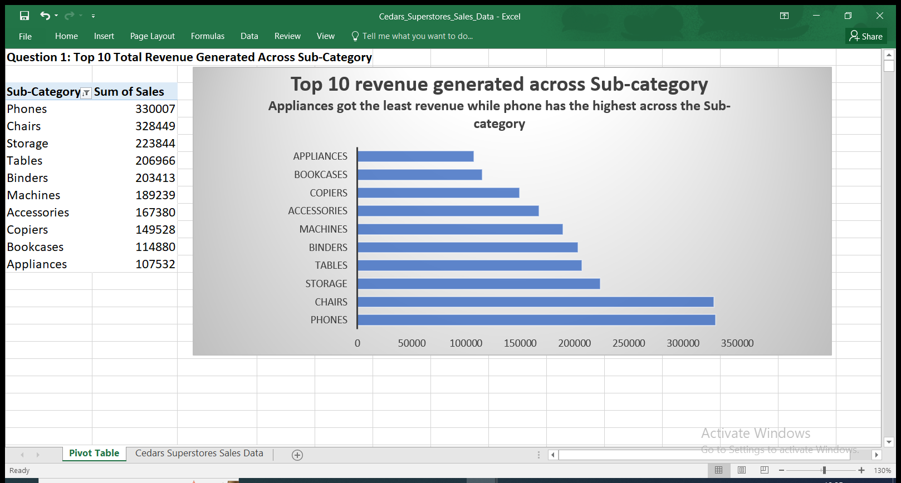

# Analysis-of-Cedars-Superstore-Sales-Data

## INTRODUCTION
At the close of the Excel session of the 3rd Data Analytic Cohort, we were asked to work on a project. The project focused on analyzing Cedars’ Superstore Sales Data in the year in view, in order to get valuable patterns and insights into the business performance and make data-driven decisions to improve the business in the New Year. The instructor tasked us to come up with business questions and proffer solutions to improve performance in the new business year. The sales data contains 9995 rows and 21 columns. Columns name as follows; **Row ID, Order ID, Order Date, Ship Date, Ship Mode, Customer ID, Customer Name, Segment, Country, City, State, Postal Code, Region, Product ID, Category, Sub-Category, Product Name, Sales, Quantity, Discount, and Profit**.

## BUSINESS QUESTIONS
Focusing on Key Performance Index such as:
-	Total Sales Value
-	Total Profit Value
-	Quantity Sold
-	Total Revenue Value

I came up with the following business questions that required only data to provide empirical and relevant answers.
1.	Which product’s **Sub-Category** generated the most revenue?
2.	Which are the less profitable across the **State**?
3.	What is the total sales across the **Region**?
4.	Which is the most preferred **Ship Mode** by customers?
5.	What is the total **Sales** and **Profit** across the product’s **Category**?
6.	What is the total **Sales** of products across the **Segment**?

## SKILLS DEMONSTRATED
Data Processing
Data Manipulation
Use of Pivot Table
Use of Pivot Chart for Visualization

## TASK SOLUTIONS

## Data Processing
Firstly, I processed the Cedars’ Superstore dataset by adjusting the column headers to properly fit into the column. I highlighted the entire top column row, then double-clicked a section, which equally adjusted all, to fit the column text properly. 
Secondly, I converted the entire data into a table format. I clicked a cell and pressed “Ctrl-A” to highlight all the datasets, followed by “Ctrl-T” to change the data to a table set.
Thirdly, I changed the date format of the ‘’Ordered Date’’ and Ship Date into Day, Month, and Year format. (DD/MM/YY). 
Lastly, I froze all column headers in the first row, opened the Freeze panes in the ‘View’ section of the ribbon, and selected ‘freeze top row’ which made all headers stationary while scrolling up and down. 

 
 

## SOLUTION 1
The first task solution is to determine which product in the **Sub-Category**, generated the most revenue in the year in question. Using the pivot table and cleaned data, I clicked a cell on the data and then proceeded to the ‘Insert’ section of the ribbon, I clicked on the ‘Pivot Table’, which popped up on the data, with the entire Table/Range automatically selected, I checked the “Existing Worksheet’’, which indicates where I want my PivotTable report to be placed. The Pivot Table Fields box appeared on the right side, featuring all columns of the dataset. I dragged the **Sales** and **Sub-Category** into the ROW and VALUES fields respectively. The table was populated with the sum of sales of products across the subcategories. I clicked the filter on the **Sub-Category** field, and I selected “More Sorting Option” to sort the sum of sales in the **Sub-Category** in descending order for me to ascertain the top 10 products that generated the most revenue across the **Sub-Categor**y. **See the visual beside for a clearer illustration**.

## SOLUTION 2
The second task solution is to find out which states are not profitable among all the states Cedars Superstore operated in the year in question. Using the pivot table and cleaned data, I clicked a cell on the data and then proceeded to the ‘Insert’ section of the ribbon, I clicked on the ‘Pivot Table’, which popped up on the data, with the entire Table/Range automatically selected, I checked the “Existing Worksheet’’, which indicates where I want my PivotTable report to be placed. The Pivot Table Fields box appeared on the right side, featuring all columns of the dataset. I dragged the **State** into the ROW fields and **Profit** into the VALUES fields.  Automatically, the sum of profit across states was displayed, as the default setting. I used the ‘Value filter’ to filter out the top 10 states where less profit was generated. **See the visual beside for a clearer illustration**.

## SOLUTION 3
To get the total sales across the four regions of operation of the Superstore, I inserted the pivot table from the ‘Insert’ section of the ribbon. The entire Table/Range is automatically selected, I checked the “Existing Worksheet’’, which indicates where I want my PivotTable report to be placed. I dragged the **Sales** and **Region** into the ROW and VALUES fields respectively. I used the ‘More Sorting Option’ to sort in descending order to arrive at the business answer to the question. **See the visual beside for a clearer illustration**.

## SOLUTION 4
To determine the most preferred shipping mode among the options on offer. I used the pivot table as usual, dragging the **Ship Mode** column into the ROW field and the **Sales** column into the VALUES field. I changed the default 'sum' function to the 'count' function, then I filtered the Number of sales values by right-clicking on the drop-down arrow on the 'ship mode' column, then I filtered the 'number of sales' column from 'A to z Ascending', this arranged the number of sales values of the ship mode column in ascending order. **See the visual report for a clearer illustration**.

## SOLUTION 5
To determine the total sales and profit across the product’s Category, Using the pivot table and cleaned data, I clicked a cell on the data and then proceeded to the ‘Insert’ section of the ribbon, I clicked on the ‘Pivot Table’, which popped up on the data, with the entire Table/Range automatically selected, I checked the “Existing Worksheet’’, which indicates where I want my PivotTable report to be placed. The Pivot Table Fields box appeared on the right side, featuring all columns of the dataset, I dragged the **Category** into the ROW field and the **Sales** and **Profit** into the VALUES field. I changed the ‘sum’ default value to ‘count’ from the ‘Value Field Setting’ to get the total number of sales made in each category. The sum of profit across the Category aligns with the default summarized value. **See the visual report for a clearer illustration**.

## SOLUTION 6 
The last task solution is to find out the total Sales across the three products segment of Cedars Superstore in the year in question. Using the pivot table and cleaned data, I clicked a cell on the data and then proceeded to the ‘Insert’ section of the ribbon, I clicked on the ‘Pivot Table’, which popped up on the data, with the entire Table/Range automatically selected, I checked the “Existing Worksheet’’, which indicates where I want my PivotTable report to be placed. The Pivot Table Fields box appeared on the right side, featuring all columns of the dataset. I dragged the **Segment** into the ROW fields and **Sales** into the VALUES fields. Automatically, the sum of sales across segments was displayed, as the default setting. **See the visual report for a clearer illustration**.

